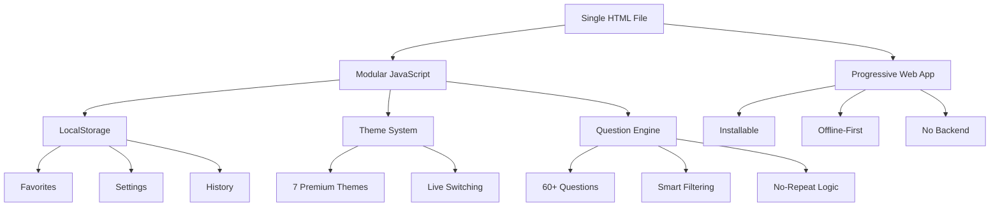
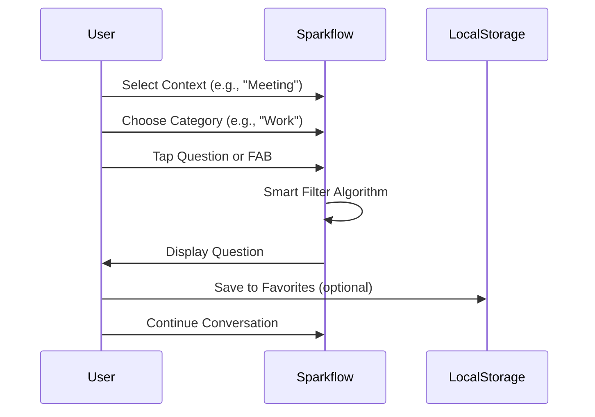

# Sparkflow ⚡

<p align="center">
  
  
  
  
  
  
</p>

<p align="center">
  <strong>The right question, at the right moment.</strong><br>
  A minimalist conversation catalyst that eliminates awkward silences without tracking, accounts, or complexity.
</p>

<p align="center">
  <a href="https://aliriyaj007.github.io/Sparkflow/" target="_blank">🌐 Live Demo</a> •
  <a href="#-instant-use">🚀 Instant Use</a> •
  <a href="#-features">✨ Features</a> •
  <a href="#-why-sparkflow">🎯 Why</a>
</p>

<p align="center">
  
</p>

## 🎯 The Problem It Solves

| Before Sparkflow | With Sparkflow |
|-----------------|----------------|
| **Awkward silence** in meetings, dates, or gatherings | **Natural flow** with curated, context-aware questions |
| **"What should we talk about?"** energy drain | **One-tap inspiration** that keeps conversations alive |
| **Repetitive small talk** that goes nowhere | **Meaningful connections** through thoughtful prompts |
| **Phone-checking escape** when conversation stalls | **Engaged participation** with everyone included |
| **No preparation** for facilitators or hosts | **Always-ready toolkit** in your pocket |

## 🚀 Instant Use (Under 60 Seconds)

1. **Open** → [aliriyaj007.github.io/Sparkflow](https://aliriyaj007.github.io/Sparkflow/)
2. **Select context** (Meeting, Date, Party, Team, Family)
3. **Tap the question** or click the ⚡ button
4. **Conversation flows**

That's it. No signup. No tracking. No complexity.

## ✨ Features at a Glance

<table>
<tr>
<td width="50%">

### 🎯 Core Engine
- **60+ Curated Questions** across 6 categories
- **Smart Filtering** by context and category
- **No-Repeat Algorithm** within sessions
- **One-Tap Randomizer** (FAB button)
- **Local Storage Only** - no cloud, no tracking

### 🎨 Premium Experience
- **7 Professional Themes** with smooth transitions
- **Google-Inspired Material Design**
- **Fully Responsive** (mobile, tablet, desktop)
- **Subtle Animations** and haptic feedback
- **Accessible** with proper contrast ratios

</td>
<td width="50%">

### ⚙️ Advanced Tools
- **Conversation Timer** with presets (1, 3, 5 min)
- **Round Mode** for group pass-around
- **Favorites System** with custom lists
- **Question History** with configurable length
- **Custom Question Creator** (local only)

### 🔧 Power User Features
- **Full Customization** panel
- **Import/Export** JSON backups
- **Keyboard Shortcuts** (Space, 1-6, Esc)
- **Auto-Advance** after favorites
- **Font Size & Animation** controls

</td>
</tr>
</table>

## 🏗️ Architecture & Tech Stack



**Technical Highlights:**
- **Zero Dependencies** (except FontAwesome CDN for icons)
- **< 50KB** total footprint
- **Vanilla JavaScript** (no frameworks)
- **IIFE Module Pattern** (no global pollution)
- **Pure CSS** with CSS Variables for theming
- **LocalStorage Abstraction** with error handling

## 🎨 Theme System

| Theme | Preview | Use Case |
|-------|---------|----------|
| **Coral Bliss** (Default) | <div style="background: linear-gradient(135deg, #FF6B6B, #4ECDC4); width: 100%; height: 20px; border-radius: 4px;"></div> | Modern, energetic, social |
| **Midnight Sky** | <div style="background: linear-gradient(135deg, #6C63FF, #36D1DC); width: 100%; height: 20px; border-radius: 4px;"></div> | Evening, professional, focused |
| **Forest Depth** | <div style="background: linear-gradient(135deg, #2E8B57, #98D8C8); width: 100%; height: 20px; border-radius: 4px;"></div> | Calm, reflective, team building |
| **Sunset Glow** | <div style="background: linear-gradient(135deg, #FF8E53, #FFCE63); width: 100%; height: 20px; border-radius: 4px;"></div> | Creative, warm, date nights |
| **Ocean Depth** | <div style="background: linear-gradient(135deg, #2D9CDB, #56CCF2); width: 100%; height: 20px; border-radius: 4px;"></div> | Clean, trustworthy, meetings |
| **Lavender Dream** | <div style="background: linear-gradient(135deg, #9B59B6, #BB8FCE); width: 100%; height: 20px; border-radius: 4px;"></div> | Soft, intimate, personal |
| **Slate Professional** | <div style="background: linear-gradient(135deg, #607D8B, #90A4AE); width: 100%; height: 20px; border-radius: 4px;"></div> | Corporate, neutral, formal |

## 📱 Installation Methods

### Method 1: Direct Use (Recommended)
```bash
# Simply visit:
https://aliriyaj007.github.io/Sparkflow/
```

### Method 2: Download & Run Locally
```bash
# Download the single HTML file
curl -O https://aliriyaj007.github.io/Sparkflow/index.html

# Open in any browser
open index.html  # macOS
start index.html # Windows
xdg-open index.html # Linux
```

### Method 3: PWA Installation
1. Visit the live demo
2. Click "Install" in your browser menu
3. Use as a standalone app (offline capable)

### Method 4: Self-Host on GitHub Pages
```bash
# Fork the repository
# Enable GitHub Pages in settings
# Your instance: https://[your-username].github.io/Sparkflow/
```

## 🎮 Usage Guide

### Basic Flow


### Keyboard Shortcuts
| Key | Action | Description |
|-----|--------|-------------|
| `Space` | New Question | Instantly generate new prompt |
| `1-6` | Category Select | Quick category switching |
| `Esc` | Close Panels | Exit customization/settings |
| `F` | Toggle Favorite | Save/remove current question |
| `T` | Timer Toggle | Start/pause conversation timer |

### Pro Tips
1. **Use Round Mode** for group settings - pass the device between people
2. **Set quick timers** (1, 3, 5 min) for speed-sharing rounds
3. **Export your favorites** before clearing browser data
4. **Create custom questions** specific to your team/family
5. **Use different themes** for different moods/occasions

## 🔧 Customization

### Settings Panel
```javascript
// All settings are stored locally
{
  theme: 'coral',           // 7 premium themes
  animationSpeed: 1,        // 0=off, 1=normal, 2=fast
  fontSize: 100,            // 80% to 120%
  autoAdvance: true,        // New question after favorite
  hapticFeedback: true,     // Vibration on tap
  historyLength: 20,        // Remember last N questions
  roundMode: false          // Group pass-around mode
}
```

### Data Management
- **Export**: Settings + Favorites + Custom Questions → JSON file
- **Import**: Restore from previously exported JSON
- **Reset**: Factory defaults with one click
- **Privacy**: Everything stays on your device

## 🤝 Contributing

Sparkflow proves its value by existing. If it proves valuable to you, consider making it better for everyone.

### Ways to Contribute
1. **Add Questions** - Submit PR with new categorized questions
2. **Report Bugs** - GitHub Issues for tracking
3. **Suggest Features** - Practical, focused enhancements
4. **Improve Code** - Cleanup, optimization, documentation
5. **Share** - Tell someone who needs it

### Development Setup
```bash
# 1. Fork the repository
# 2. Clone your fork
git clone https://github.com/your-username/Sparkflow.git

# 3. That's it. Open index.html in a browser.
# No build process. No dependencies. No tooling.
```

### Contribution Guidelines
- **Keep it simple** - Single file architecture is sacred
- **No frameworks** - Vanilla JS/CSS/HTML only
- **Privacy first** - No tracking, no analytics, no external calls
- **Performance** - Keep bundle size < 50KB
- **Accessibility** - WCAG 2.1 AA compliance

### Question Submission Format
```javascript
// Add to appropriate category in QuestionEngine
deep: [
  // ... existing questions
  "Your new thought-provoking question here?",
  // ...
],
```

## 📊 Project Stats & Goals

**Current State:**
- ✅ Single HTML file (45KB)
- ✅ Zero dependencies
- ✅ 100% client-side
- ✅ No database required
- ✅ No AI/ML dependencies
- ✅ Fully offline capable
- ✅ MIT Licensed

**Project Goals:**
1. Solve awkward silences effectively
2. Respect user privacy completely
3. Maintain simplicity absolutely
4. Work everywhere immediately

## 🛡️ Privacy & Security

### What We Store (Locally Only)
- Your favorite questions
- Your custom questions
- Your theme preferences
- Your usage settings
- Recent question history

### What We Never Do
- ❌ No data leaves your device
- ❌ No analytics tracking
- ❌ No user accounts
- ❌ No cloud synchronization
- ❌ No third-party scripts
- ❌ No telemetry

### Data Lifecycle
```
Your Device → LocalStorage → Your Device
     ↑                             ↓
  You modify                  You export
     ↓                             ↑
  You use                    You import (optional)
```

## 📖 FAQ

### Q: Why a single HTML file?
**A:** Maximum portability. Send it via email, use it offline, host it anywhere. No setup required.

### Q: How is this different from other conversation apps?
**A:** Most are either too complex (social features, accounts) or too limited (static lists). Sparkflow balances curation with customization while respecting privacy.

### Q: Can I use this commercially?
**A:** Yes, MIT License allows any use. Attribution appreciated but not required.

### Q: What happens if I clear browser data?
**A:** Your settings and favorites will be lost. Export them first via Settings → Export Data.

### Q: Can I add my own questions?
**A:** Yes, via the customization panel. They're stored locally on your device.

### Q: Is there an API?
**A:** No, and there won't be. The value is in the self-contained simplicity.

## 🚀 Roadmap

### Phase 1: Core Stability ✅
- [x] Single file architecture
- [x] 60+ curated questions
- [x] 7 premium themes
- [x] LocalStorage persistence
- [x] PWA capabilities

### Phase 2: Enhancement (Current)
- [ ] Question pack system (modular JSON loads)
- [ ] Advanced filtering (by time, intimacy level)
- [ ] Conversation analytics (local only)
- [ ] Enhanced sharing options
- [ ] More theme variations

### Phase 3: Ecosystem
- [ ] Browser extension version
- [ ] CLI version for developers
- [ ] Team/Enterprise features (still local-first)
- [ ] Internationalization support
- [ ] Question community repository

## 📄 License

MIT License - see [LICENSE](LICENSE) file for details.

```
Copyright 2024 Riyajul Ali

Permission is hereby granted, free of charge, to any person obtaining a copy
of this software and associated documentation files (the "Software"), to deal
in the Software without restriction, including without limitation the rights
to use, copy, modify, merge, publish, distribute, sublicense, and/or sell
copies of the Software, and to permit persons to whom the Software is
furnished to do so, subject to the following conditions:

The above copyright notice and this permission notice shall be included in all
copies or substantial portions of the Software.

THE SOFTWARE IS PROVIDED "AS IS", WITHOUT WARRANTY OF ANY KIND, EXPRESS OR
IMPLIED, INCLUDING BUT NOT LIMITED TO THE WARRANTIES OF MERCHANTABILITY,
FITNESS FOR A PARTICULAR PURPOSE AND NONINFRINGEMENT. IN NO EVENT SHALL THE
AUTHORS OR COPYRIGHT HOLDERS BE LIABLE FOR ANY CLAIM, DAMAGES OR OTHER
LIABILITY, WHETHER IN AN ACTION OF CONTRACT, TORT OR OTHERWISE, ARISING FROM,
OUT OF OR IN CONNECTION WITH THE SOFTWARE OR THE USE OR OTHER DEALINGS IN THE
SOFTWARE.
```

## 👤 Author & Contact

**Riyajul Ali**  
Building tools that solve real problems with elegant simplicity.

- 🌐 **GitHub**: [github.com/Aliriyaj007](https://github.com/Aliriyaj007)
- 📧 **Email**: [aliriyaj007@protonmail.com](mailto:aliriyaj007@protonmail.com)
- 💼 **LinkedIn**: [linkedin.com/in/Aliriyaj007](https://linkedin.com/in/Aliriyaj007)
- 🚀 **Live App**: [aliriyaj007.github.io/Sparkflow](https://aliriyaj007.github.io/Sparkflow/)

---

<p align="center">
  <em>If this tool saves you from one awkward silence, it has done its job.</em><br>
  <em>If it helps create one meaningful connection, it has exceeded expectations.</em>
</p>

<p align="center">
  <strong>⭐ Star if useful • 🍴 Fork if improvable • 🚀 Use if needed</strong>
</p>
